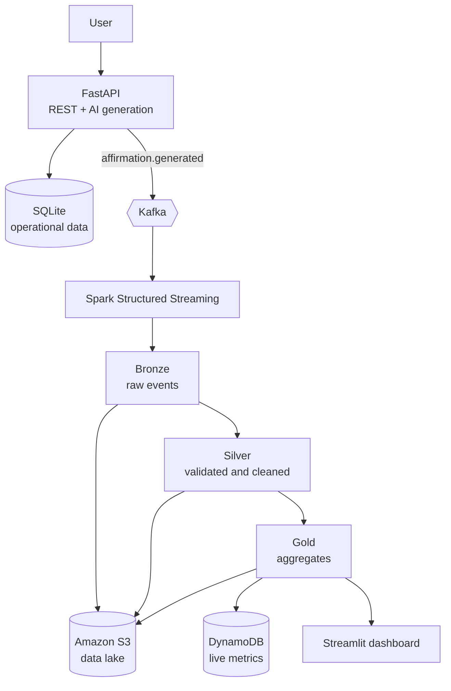

<div align="center">

# ✨ Affirmation Intelligence Platform

**A tiny affirmation generator that grew up into a streaming data platform.**


</div>

Tell it how you feel and what you're working toward, and it writes you a personalised affirmation.

Under the hood, every request becomes an event that flows through Kafka and Spark into a Bronze / Silver / Gold data pipeline, so I could practise the full journey from product idea to analytics.

## The story

It started as a small Python script that printed motivational messages.

Then I asked: *what would this look like if a real team built it?*

I added an API, persistence, event streaming, data processing, analytics and cloud infrastructure. The idea stayed simple, but the engineering problem became much bigger.

## How it works



The flow is:

1. A request reaches the **FastAPI** service.
2. The service generates an affirmation using OpenAI or a built-in fallback.
3. The result is saved to the operational database.
4. An `affirmation.generated` event is published to **Kafka**.
5. **Spark Structured Streaming** validates, cleans and aggregates the events.
6. Data moves through **Bronze → Silver → Gold** layers.
7. Processed data can be synced to **Amazon S3**, with Gold metrics written to **DynamoDB**.
8. The **Streamlit** dashboard displays analytics from the processed data.

## Try it

You do not need an OpenAI API key to run the project. Without one, the application uses a deterministic fallback generator.

```bash
python -m venv .venv

# Windows
.venv\Scripts\Activate.ps1

# macOS/Linux
source .venv/bin/activate

pip install -r requirements.txt
cp .env.example .env
docker compose up -d kafka
uvicorn app.main:app --reload
```

On Windows, if `cp` is unavailable:

```powershell
Copy-Item .env.example .env
```

Open:

```text
http://127.0.0.1:8000/docs
```

Then try:

```text
POST /api/v1/affirmations/generate
```

Example request:

```json
{
  "name": "Zinhle",
  "mood": "nervous",
  "goal": "grow as a data engineer",
  "category": "career",
  "tone": "encouraging"
}
```

## Run the data pipeline

Start the Kafka consumer:

```bash
python -m streaming.kafka_consumer
```

Run Spark Structured Streaming:

```bash
spark-submit --packages org.apache.spark:spark-sql-kafka-0-10_2.12:3.5.3 streaming/spark_streaming.py
```

Run the batch ETL:

```bash
python -m pipeline.batch_etl
```

Start the analytics dashboard:

```bash
streamlit run dashboard.py
```

The streaming job writes data to:

```text
data/lake/bronze_stream/
data/lake/silver_stream/
data/lake/gold_stream/
data/lake/checkpoints/
```

## What an event looks like

```json
{
  "event_id": "2de53416-d663-41b4-9027-4ad78eb15865",
  "event_type": "affirmation.generated",
  "affirmation_id": 21,
  "mood": "nervous",
  "goal": "become a confident software developer",
  "category": "career",
  "tone": "encouraging",
  "source": "openai",
  "created_at": "2026-09-29T10:00:00+00:00"
}
```

## The data layers

| Layer | What's in it | What happens here |
|---|---|---|
| 🥉 **Bronze** | Raw events | Stored with minimal transformation |
| 🥈 **Silver** | Validated and cleaned events | Invalid records are filtered, timestamps parsed and fields standardised |
| 🥇 **Gold** | Aggregated data | Counts by category, source and time window |

## Why Kafka and Spark?

Kafka moves events between parts of the system.

Spark processes those events.

Keeping transport and processing separate gave me a better understanding of how a streaming pipeline can be split into clear responsibilities:

```text
API → Event Transport → Processing → Storage → Analytics
```

## API

| Method | Endpoint | Purpose |
|---|---|---|
| GET | `/health` | Service health |
| POST | `/api/v1/affirmations/generate` | Generate an affirmation |
| GET | `/api/v1/affirmations/history` | View recent affirmations |
| POST | `/api/v1/affirmations/{id}/feedback` | Store feedback |
| GET | `/api/v1/analytics/summary` | View operational analytics |

## AWS and Terraform

Terraform defines the cloud infrastructure for the project, including:

- Amazon ECR
- Amazon ECS
- AWS Fargate
- Amazon S3
- Amazon DynamoDB
- CloudWatch
- IAM roles
- Security groups

To initialise the infrastructure:

```bash
cd terraform
terraform init
terraform plan
```

To create the resources:

```bash
terraform apply
```

> `terraform apply` can create billable AWS resources. Run `terraform destroy` when you are finished testing.

## Tests and CI

Run the test suite with:

```bash
pytest
```

Tests cover:

- AI generation
- API endpoints
- Kafka event publishing
- ETL logic
- data-quality behaviour

GitHub Actions runs the test suite automatically on pushes through:

```text
.github/workflows/ci.yml
```

## Tech stack

| Area | Technology |
|---|---|
| **API & AI** | Python, FastAPI, SQLAlchemy, OpenAI integration |
| **Streaming** | Apache Kafka, Spark Structured Streaming |
| **Data Engineering** | Batch ETL, Bronze / Silver / Gold architecture |
| **Cloud** | Amazon S3, DynamoDB, ECS, Fargate, ECR, CloudWatch |
| **Infrastructure** | Terraform |
| **DevOps** | Docker, Docker Compose, GitHub Actions |
| **Testing** | Pytest |
| **Analytics** | Streamlit |

## What's next

- [ ] Show a sample of real Gold-layer output
- [ ] Run the Terraform infrastructure end-to-end on AWS
- [ ] Add AWS Glue Data Catalog
- [ ] Query the S3 data lake with Athena
- [ ] Add a dead-letter topic
- [ ] Add Schema Registry with Avro
- [ ] Move Spark checkpoints to S3
- [ ] Replace SQLite with PostgreSQL
- [ ] Add authentication

---

<p align="center">Built by <a href="https://github.com/ZinhleHlongwane">Zinhle Hlongwane</a> · Johannesburg 🇿🇦 · <a href="https://www.linkedin.com/in/zinhle-hlongwane-872354209">LinkedIn</a></p>
