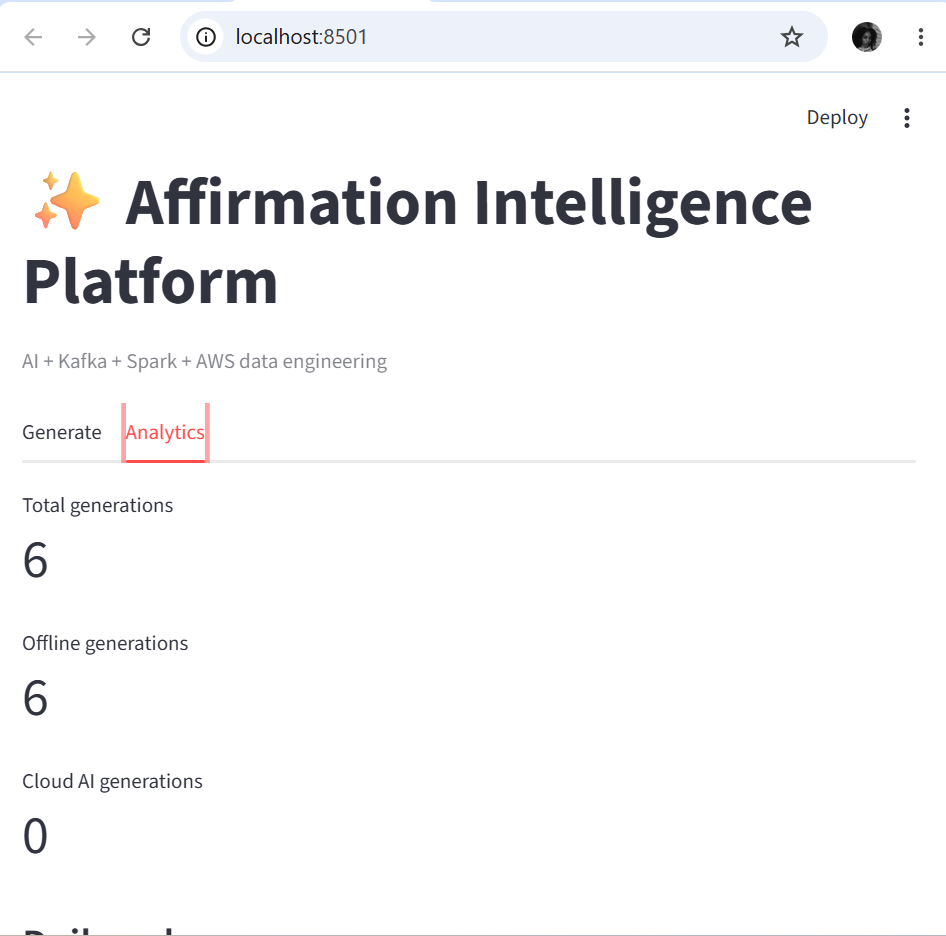
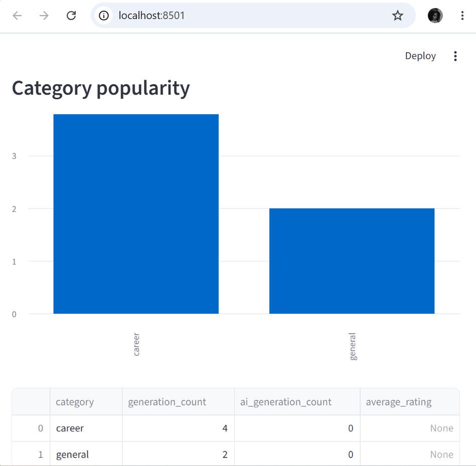
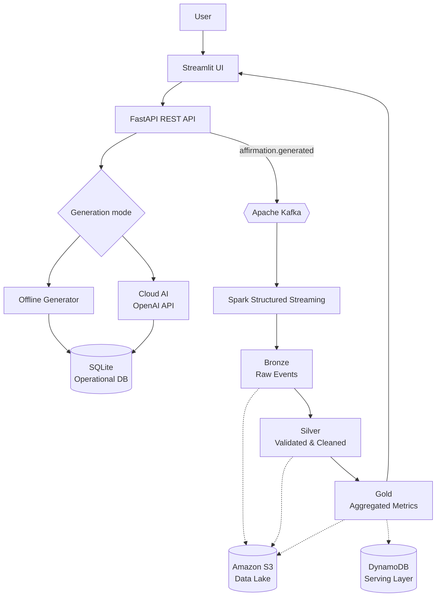

<div align="center">

# ✨ Affirmation Intelligence Platform

**A tiny affirmation generator that grew up into an event-driven data platform.**


</div>

Tell the platform how you feel and what you're working toward, and it generates a personalised affirmation.

What started as a simple Python affirmation generator became a larger engineering project involving a FastAPI backend, persistent storage, Kafka events, Spark processing, Bronze/Silver/Gold data layers, analytics, Docker, Terraform and an AWS deployment path.

The platform works in two generation modes:

- **Offline Generator** — works locally without paid API credits
- **Cloud AI** — uses the configured OpenAI API when API access and credits are available

The data pipeline works regardless of which generation mode produced the affirmation.

---

## 📊 Analytics

The Streamlit dashboard provides an operational view of generated affirmations and processed Gold-layer metrics.

### Generation overview

<p align="center">
  
</p>

The dashboard clearly separates local and cloud-based generation:

- Total generations
- Offline generations
- Cloud AI generations

### Category popularity

<p align="center">
  
</p>

The category view is generated from the Gold analytics layer rather than directly from the application form.

---

## 🌱 The story

The project started as a small Python script that printed motivational messages.

Then I asked:

> What would this look like if it were treated as a real software and data engineering system?

That led to adding:

- a REST API
- persistent application data
- structured generation events
- Kafka event transport
- Spark processing
- Bronze, Silver and Gold data layers
- analytics
- Docker
- CI
- Terraform
- an AWS deployment path

The affirmation itself stayed simple.

The engineering underneath it did not.

---

## 🏗️ Architecture



---

## 🔄 Main flow

1. A user enters their name, mood, goal, category and preferred tone.
2. The request is sent from Streamlit to the FastAPI service.
3. The application selects the available generation mode.
4. The generated affirmation is saved to the operational database.
5. An `affirmation.generated` event is published to Kafka.
6. Spark consumes and processes the event stream.
7. Data moves through Bronze → Silver → Gold transformations.
8. Gold datasets provide aggregated analytics.
9. Streamlit visualises the processed metrics.
10. The same data architecture can be extended to S3 and DynamoDB.

---

## 📴 Offline Generator

The application does not require a paid AI API to remain usable.

When cloud AI is unavailable, the platform intentionally switches to its local generation mode.

Example UI output:

```text
Mode: Offline Generator
Category: career
Tone: encouraging
```

The dashboard also presents this explicitly as:

```text
Total generations
Offline generations
Cloud AI generations
```

This keeps the local path visible as a supported operating mode rather than presenting it as an application failure.

---

## ☁️ Optional Cloud AI

If API access is configured, the same service can generate affirmations through OpenAI.

Environment configuration:

```env
AI_ENABLED=true
OPENAI_API_KEY=
OPENAI_MODEL=gpt-5.6-luna
```

If a valid API key and available credits are present, generated records use:

```text
source = openai
```

Otherwise the platform continues through its offline generation path:

```text
source = fallback
```

The internal `fallback` value is retained for pipeline compatibility while the UI presents it as **Offline Generator**.

---

# 🥉🥈🥇 Bronze / Silver / Gold Pipeline

The project uses a medallion-style data architecture.

## Bronze

Raw generation events with minimal transformation.

```text
data/lake/bronze/affirmation_events_raw.csv
```

Purpose:

- preserve the original event data
- provide traceability
- retain raw inputs before cleaning

---

## Silver

Validated and cleaned events.

```text
data/lake/silver/affirmation_events_clean.csv
```

Processing includes:

- validating expected event types
- cleaning categories
- standardising generation sources
- validating affirmation text
- parsing timestamps
- deriving event dates
- removing invalid records

---

## Gold

Aggregated datasets designed for analytics.

```text
data/lake/gold/category_metrics.csv
data/lake/gold/daily_metrics.csv
```

Gold metrics include:

- total generations
- offline vs Cloud AI generations
- category popularity
- daily generation volume
- average ratings when feedback exists

---

# ✅ Pipeline proof

The pipeline has been run against real application-generated records.

Running:

```bash
python -m pipeline.batch_etl
```

produced:

```text
{
    'bronze_rows': 6,
    'silver_rows': 6,
    'gold_daily_rows': 1,
    'gold_category_rows': 2
}
```

Generated data-lake structure:

```text
data/lake/
├── bronze/
│   └── affirmation_events_raw.csv
│
├── silver/
│   └── affirmation_events_clean.csv
│
└── gold/
    ├── category_metrics.csv
    └── daily_metrics.csv
```

### Gold category metrics

| Category | Generations | Cloud AI |
|---|---:|---:|
| career | 4 | 0 |
| general | 2 | 0 |

### Gold daily metrics

| Event date | Total | Cloud AI | Offline |
|---|---:|---:|---:|
| 2026-10-06 | 6 | 0 | 6 |

This confirms that the project is producing the complete transformation path:

**Raw events → cleaned events → aggregated analytics**

---

# 📨 Event example

A generation is represented as a structured event:

```json
{
  "event_id": "2de53416-d663-41b4-9027-4ad78eb15865",
  "event_type": "affirmation.generated",
  "affirmation_id": 21,
  "name": "Zinhle",
  "mood": "determined",
  "goal": "become a professional software engineer",
  "category": "career",
  "tone": "encouraging",
  "source": "fallback",
  "affirmation": "Zinhle, i can keep working toward become a professional software engineer one practical step at a time.",
  "created_at": "2026-10-06T22:58:00+00:00"
}
```

The `source` field allows the data pipeline to distinguish between local and cloud-generated records.

---

# 🚀 Quick start

## 1. Clone the repository

```bash
git clone https://github.com/ZinhleHlongwane/affirmation-generator.git
cd affirmation-generator
```

---

## 2. Create a virtual environment

```bash
python -m venv .venv
```

Windows PowerShell:

```powershell
.\.venv\Scripts\Activate.ps1
```

macOS/Linux:

```bash
source .venv/bin/activate
```

---

## 3. Install dependencies

```bash
pip install -r requirements.txt
```

---

## 4. Configure environment variables

Windows:

```powershell
Copy-Item .env.example .env
```

macOS/Linux:

```bash
cp .env.example .env
```

The application works without a paid AI API.

For local-only operation:

```env
AI_ENABLED=true
OPENAI_API_KEY=
```

The Offline Generator will automatically handle generation.

---

## 5. Start Kafka

```bash
docker compose up -d kafka
```

---

## 6. Start the FastAPI backend

```bash
python -m uvicorn app.main:app
```

API:

```text
http://127.0.0.1:8000
```

Interactive API documentation:

```text
http://127.0.0.1:8000/docs
```

---

## 7. Start the Streamlit application

Open another terminal:

```bash
python -m streamlit run dashboard.py
```

Then open:

```text
http://localhost:8501
```

---

## 8. Generate an affirmation

Example input:

```json
{
  "name": "Zinhle",
  "mood": "nervous",
  "goal": "prepare confidently for a software engineering interview",
  "category": "career",
  "tone": "encouraging"
}
```

---

## 9. Run the batch ETL

```bash
python -m pipeline.batch_etl
```

This creates or updates:

```text
data/lake/bronze/
data/lake/silver/
data/lake/gold/
```

Refresh the Analytics tab afterwards to view the latest Gold metrics.

---

# 🌊 Kafka

Kafka acts as the event transport layer.

Each generated affirmation produces an event such as:

```text
affirmation.generated
```

The event contains the generation context, result, source and timestamp.

Inspect events with:

```bash
python -m streaming.kafka_consumer
```

Kafka is responsible for moving events.

It is intentionally kept separate from the processing layer.

---

# ⚡ Spark Structured Streaming

Spark handles distributed processing and transformation.

Run the streaming job with:

```bash
spark-submit \
  --packages org.apache.spark:spark-sql-kafka-0-10_2.12:3.5.3 \
  streaming/spark_streaming.py
```

The streaming architecture allows the project to move toward continuous processing rather than relying only on batch execution.

---

# 🤝 Why Kafka and Spark?

They solve different problems.

### Kafka

Handles:

- event ingestion
- event transport
- decoupling producers and consumers
- distributing generated events

### Spark

Handles:

- validation
- transformation
- enrichment
- aggregation
- analytical processing

Together they create a clearer separation:

```text
Application
    ↓
Event transport
    ↓
Processing
    ↓
Storage
    ↓
Analytics
```

rather than using technologies only as isolated portfolio keywords.

---

# 🌐 API

| Method | Endpoint | Purpose |
|---|---|---|
| `GET` | `/health` | Service health |
| `POST` | `/api/v1/affirmations/generate` | Generate an affirmation |
| `GET` | `/api/v1/affirmations/history` | View recent generations |
| `POST` | `/api/v1/affirmations/{id}/feedback` | Store user feedback |
| `GET` | `/api/v1/analytics/summary` | Retrieve operational analytics |

---

# 🧪 Testing

The project uses `pytest`.

Run the test suite with:

```bash
pytest
```

Tests cover areas including:

- affirmation generation
- API behaviour
- events
- Kafka publishing
- ETL transformations
- data quality

---

# 🔁 Continuous Integration

GitHub Actions is used for automated verification.

The workflow runs checks when changes are pushed to the repository.

CI helps verify that application changes do not silently break the tested behaviour.

---

# 🐳 Docker

The project includes:

```text
Dockerfile
docker-compose.yml
```

Docker Compose is used locally to start infrastructure such as Kafka.

Example:

```bash
docker compose up -d kafka
```

---

# ☁️ AWS architecture

The repository includes an AWS deployment path.

The infrastructure is defined with Terraform and supporting Python modules.

The cloud architecture includes definitions for:

- Amazon ECR
- Amazon ECS
- AWS Fargate
- Amazon S3
- Amazon DynamoDB
- Amazon CloudWatch
- IAM roles
- security groups
- default-VPC subnet discovery

The application does **not** require these resources for local development.

---

## Amazon S3

`aws/s3_data_lake.py` supports uploading lake layers to:

```text
s3://<bucket>/bronze/
s3://<bucket>/silver/
s3://<bucket>/gold/
```

This provides a cloud storage path for the medallion architecture.

---

## DynamoDB

`aws/dynamodb_repository.py` supports storing Gold-layer metrics for low-latency access.

Example key pattern:

```text
PK: CATEGORY#career
SK: LATEST
```

---

## ECS / Fargate

Terraform defines infrastructure for container-based API deployment.

Typical workflow:

```bash
cd terraform
terraform init
terraform plan
terraform apply
```

> ⚠️ `terraform apply` can create billable AWS resources. Review the plan before applying and destroy unused resources afterwards.

The repository currently defines this deployment path; running the full AWS deployment remains an optional next step.

---

# 📁 Project structure

```text
affirmation-generator/
│
├── app/
│   ├── api/
│   │   └── routes.py
│   │
│   ├── core/
│   │   └── config.py
│   │
│   ├── db/
│   │   ├── database.py
│   │   └── models.py
│   │
│   ├── events/
│   │   ├── models.py
│   │   ├── publisher.py
│   │   └── kafka_publisher.py
│   │
│   ├── services/
│   │   ├── affirmation_service.py
│   │   └── ai_service.py
│   │
│   ├── main.py
│   └── schemas.py
│
├── aws/
│   ├── dynamodb_repository.py
│   └── s3_data_lake.py
│
├── data/
│   ├── lake/
│   │   ├── bronze/
│   │   ├── silver/
│   │   └── gold/
│   └── seed_affirmations.csv
│
├── docs/
│   └── images/
│       ├── analytics-overview.png
│       └── category-popularity.png
│
├── pipeline/
│   ├── batch_etl.py
│   └── quality.py
│
├── streaming/
│   ├── kafka_consumer.py
│   └── spark_streaming.py
│
├── terraform/
│   ├── main.tf
│   ├── outputs.tf
│   └── variables.tf
│
├── tests/
│   ├── test_ai_service.py
│   ├── test_api.py
│   ├── test_events.py
│   └── test_pipeline.py
│
├── .github/
│   └── workflows/
│       └── ci.yml
│
├── .env.example
├── .gitignore
├── dashboard.py
├── docker-compose.yml
├── Dockerfile
├── Makefile
├── pyproject.toml
├── requirements.txt
└── README.md
```

---

# 🛠️ Tech stack

### Application

- Python
- FastAPI
- SQLAlchemy
- Pydantic
- SQLite
- Streamlit

### Generation

- Local deterministic Offline Generator
- Optional OpenAI API integration

### Data engineering

- Apache Kafka
- Apache Spark
- Pandas
- Bronze / Silver / Gold architecture

### Cloud

- Amazon S3
- Amazon DynamoDB
- Amazon ECS
- AWS Fargate
- Amazon ECR
- Amazon CloudWatch

### Infrastructure & DevOps

- Docker
- Docker Compose
- Terraform
- GitHub Actions

### Testing

- pytest

---

# 💡 What this project demonstrates

This repository is intended to demonstrate more than affirmation generation.

It shows how a small application can evolve into a system containing:

- REST API design
- service separation
- persistent application data
- graceful degradation
- local and cloud generation modes
- event-driven architecture
- Kafka messaging
- structured event schemas
- data validation
- batch ETL
- streaming processing
- medallion architecture
- analytics
- containerisation
- automated testing
- CI
- infrastructure as code
- cloud architecture

---

# 🎤 Interview summary

> I started with a basic Python affirmation generator and redesigned it as an event-driven software and data engineering platform. FastAPI handles requests, the service supports both an offline generator and optional cloud AI, Kafka carries generation events, and Spark processes those events into Bronze, Silver and Gold datasets. Streamlit visualises the Gold metrics, while Docker, GitHub Actions, Terraform and AWS modules provide the infrastructure and deployment path. I also designed the system so it remains fully usable without paid AI API access.

---

# 🗺️ Roadmap

- [x] FastAPI REST API
- [x] SQLite operational persistence
- [x] Offline affirmation generation
- [x] Optional OpenAI integration
- [x] Kafka event publishing
- [x] Batch ETL
- [x] Bronze data layer
- [x] Silver data layer
- [x] Gold data layer
- [x] Streamlit analytics dashboard
- [x] Analytics screenshots
- [x] Docker support
- [x] Automated tests
- [x] GitHub Actions CI
- [x] Terraform infrastructure definitions
- [x] S3 integration module
- [x] DynamoDB integration module
- [ ] Run Terraform infrastructure end-to-end on AWS
- [ ] Amazon Glue Data Catalog
- [ ] Athena queries over S3
- [ ] Dead-letter Kafka topic
- [ ] Schema Registry / Avro
- [ ] Spark checkpoints in S3
- [ ] PostgreSQL production database
- [ ] Authentication
- [ ] Scheduled personalised affirmations

---

<div align="center">

**Simple for the user. Thoughtful underneath.**

</div>